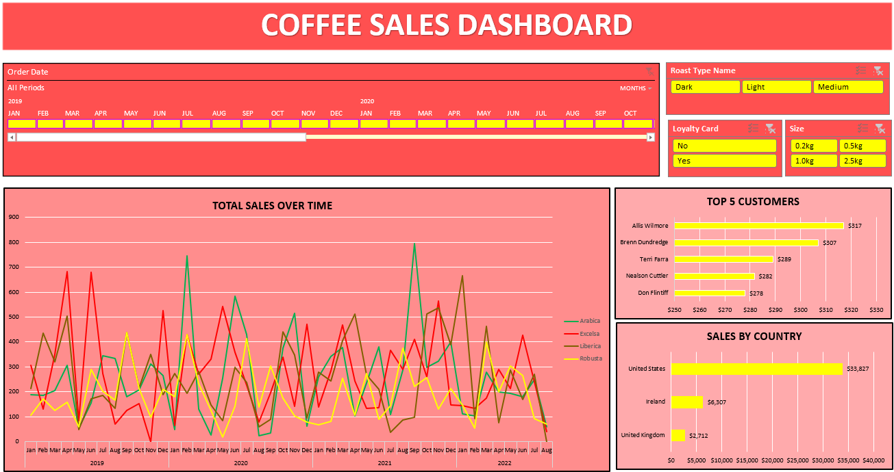

# ☕ Coffee Sales Analysis & Interactive Excel Dashboard

## 📊 Project Overview

This project presents an interactive **Coffee Sales Analysis Dashboard** developed using **Microsoft Excel**.

The dashboard transforms raw coffee sales data into an interactive business reporting solution, allowing users to analyze sales performance across different time periods, customers, countries, coffee roast types, loyalty-card usage, and product sizes.

The project demonstrates the practical use of **Excel-based data analysis, Pivot Tables, Pivot Charts, Slicers, and Timeline filters** to convert raw data into meaningful and easy-to-understand visual insights.

---

## 🎯 Business Objective

The objective of this project is to analyze coffee sales data and develop an interactive dashboard that can help answer important business questions, including:

- How do total sales change over time?
- Which customers contribute the most to sales?
- Which countries generate the highest sales?
- How do different coffee roast types perform?
- How does loyalty-card membership relate to sales activity?
- Which product sizes are being purchased?
- How does sales performance vary across different months and years?

The dashboard is designed to provide a centralized view of sales performance and make data exploration faster and more intuitive.

---

## 🛠️ Tools & Technologies

- **Microsoft Excel**
- Pivot Tables
- Pivot Charts
- Slicers
- Timeline Filters
- Data Cleaning & Preparation
- Data Analysis
- Data Visualization
- Sales Analysis
- Customer Analysis
- Time-Series Analysis
- Business Reporting

---

## 📈 Dashboard Features

### 📊 Total Sales Over Time

The dashboard includes a time-series line chart that visualizes coffee sales performance across multiple months and years.

This allows users to explore changes and patterns in sales over time.

### 👥 Top 5 Customers

The dashboard identifies the **Top 5 Customers based on sales contribution**.

This provides a quick view of customers generating significant sales and allows customer-level performance to be explored.

### 🌍 Sales by Country

The dashboard provides a country-level comparison of sales performance.

The available analysis includes:

- United States
- Ireland
- United Kingdom

This helps users understand how sales are distributed across different markets.

### ☕ Roast Type Analysis

The dashboard includes an interactive Roast Type filter with:

- Dark
- Light
- Medium

Users can select a roast type and dynamically explore the corresponding sales performance.

### 💳 Loyalty Card Analysis

The dashboard includes a Loyalty Card filter with:

- Yes
- No

This allows users to explore sales based on loyalty-card membership.

### 📦 Product Size Analysis

The dashboard includes an interactive Size filter with:

- 0.2kg
- 0.5kg
- 1.0kg
- 2.5kg

This allows product-size preferences and sales performance to be explored interactively.

### 📅 Order Date Analysis

An interactive Order Date Timeline allows users to filter the dashboard by different periods and analyze sales performance across months and years.

---

## 🎛️ Interactive Dashboard Filters

The dashboard contains multiple interactive controls that allow users to dynamically analyze the data.

### Order Date

Users can select different periods using the Timeline to analyze sales performance over time.

### Roast Type

Users can filter between:

`Dark | Light | Medium`

### Loyalty Card

Users can filter between:

`Yes | No`

### Product Size

Users can filter between:

`0.2kg | 0.5kg | 1.0kg | 2.5kg`

The dashboard visuals update based on the selected filters, making it possible to explore different combinations of the sales data.

---

## 🔍 Key Analysis Areas

| Analysis Area | Business Purpose |
|---|---|
| Sales Trends | Understand how sales change over time |
| Top Customers | Identify customers with high sales contribution |
| Country Analysis | Compare sales performance across markets |
| Roast Type Analysis | Explore sales across different roast categories |
| Loyalty Card Analysis | Examine sales based on loyalty-card membership |
| Product Size Analysis | Explore sales across different product sizes |
| Time Analysis | Analyze monthly and yearly sales patterns |

---

## 🔄 Data Analysis Workflow

The project follows a structured data analysis workflow:

```text
Raw Sales Data
      ↓
Data Cleaning & Preparation
      ↓
Pivot Tables
      ↓
Pivot Charts
      ↓
Slicers & Timeline
      ↓
Interactive Dashboard
      ↓
Business Analysis
````

---

## 💡 Business Insights

The dashboard enables users to explore and identify patterns related to:

* Sales performance across different time periods.
* Customers contributing significantly to overall sales.
* Sales distribution across different countries.
* Differences in performance across coffee roast types.
* Sales activity based on loyalty-card membership.
* Product-size purchasing patterns.
* Periods of higher or lower sales activity.

These insights can support business activities such as sales monitoring, customer analysis, product planning, market analysis, and marketing decision-making.

---

## 📊 Example Findings from the Dashboard

Based on the dashboard visualization, the available data shows:

* The **United States** represents the largest sales contribution among the countries displayed.
* The dashboard highlights the **Top 5 Customers** based on sales contribution.
* Sales performance varies considerably across different months and years.
* The dashboard provides interactive filtering across roast type, loyalty-card status, product size, and date.

The interactive nature of the dashboard allows these observations to be explored further rather than relying only on static reports.

---

## 📷 Dashboard Preview



---

## 📂 Project Structure

```text
coffee-sales-analysis-excel-dashboard/
│
├── Coffee_Sales_Analysis_Dashboard.xlsx
│
├── Dashboard_Screenshot.png
│
└── README.md
```

---

## 📁 Project Files

### `Coffee_Sales_Analysis_Dashboard.xlsx`

The main Excel workbook containing the coffee sales data analysis, Pivot Tables, Pivot Charts, interactive filters, Timeline, and final dashboard.

### `Dashboard_Screenshot.png`

A preview image of the completed Coffee Sales Dashboard.

### `README.md`

Project documentation covering the project objective, tools, dashboard features, analysis areas, workflow, and outcome.

---

## 🚀 Project Outcome

The final outcome of this project is an interactive Excel dashboard that transforms raw coffee sales data into a structured and visually accessible business reporting solution.

The dashboard brings together:

* Sales trend analysis
* Customer performance analysis
* Country-level sales analysis
* Roast type filtering
* Loyalty-card analysis
* Product-size analysis
* Time-based analysis

By combining **Pivot Tables, Pivot Charts, Slicers, and Timeline filters**, the dashboard allows users to interact with the data and explore different dimensions of sales performance without manually reviewing individual records.

This project strengthened my practical understanding of how Excel can be used to transform raw business data into interactive reports that support data analysis and business decision-making.

---

## 📚 Skills Demonstrated

### Technical Skills

* Microsoft Excel
* Pivot Tables
* Pivot Charts
* Slicers
* Timeline
* Data Cleaning
* Data Visualization
* Sales Analysis

### Analytical Skills

* Trend Analysis
* Customer Analysis
* Country-Level Analysis
* Comparative Analysis
* Pattern Identification
* Time-Series Analysis
* Data Interpretation

### Business Skills

* Business Reporting
* KPI-Oriented Analysis
* Customer Performance Analysis
* Sales Performance Monitoring
* Data-Driven Decision Support

---

## 🎓 Key Learnings

Through this project, I gained hands-on experience in building an interactive Excel dashboard and learned how to:

* Prepare and organize sales data for analysis.
* Build Pivot Tables to summarize large datasets.
* Create Pivot Charts for visual analysis.
* Use Slicers to make dashboards interactive.
* Use Timeline filters for date-based analysis.
* Analyze customer and country-level sales performance.
* Identify patterns in sales over time.
* Present business data through clear visualizations.
* Translate raw data into useful business information.

---

## 💼 Business Analyst Perspective

This project follows a simplified Business Analyst and Data Analyst workflow:

```text
Business Questions
       ↓
Raw Data
       ↓
Data Preparation
       ↓
Data Analysis
       ↓
Visualization
       ↓
Insights
       ↓
Business Decision Support
```

Instead of simply presenting raw sales numbers, the dashboard provides an interactive way for users to investigate different aspects of business performance.

The project demonstrates how analytical tools can be used to bridge the gap between **raw data and business understanding**.

---

## 🔮 Future Improvements

Potential future enhancements for this project include:

* Adding KPI cards for Total Sales, Total Orders, and Average Sales.
* Adding monthly and yearly sales comparisons.
* Adding Year-over-Year sales growth analysis.
* Adding additional customer segmentation.
* Adding product-level performance analysis.
* Adding more detailed country-level analysis.
* Creating additional interactive charts.
* Rebuilding the dashboard using **Microsoft Power BI**.
* Connecting the dashboard to a larger or regularly updated dataset.

---

## 👩‍💻 Author

**Your Name**

Aspiring Business Analyst | Data Analyst

**Skills:** Excel | SQL | Power BI | Python | Data Analysis | Business Analytics

---

## ⭐ Project Highlights

📊 **Interactive Excel Dashboard**

📈 **Sales Trend Analysis**

👥 **Top 5 Customer Analysis**

🌍 **Country-Level Sales Analysis**

☕ **Roast Type Analysis**

💳 **Loyalty Card Analysis**

📦 **Product Size Analysis**

📅 **Timeline-Based Analysis**

🔄 **Pivot Tables & Pivot Charts**

📌 **Interactive Business Reporting**

---

## 🙌 Thank You

Thank you for exploring this project.

This project represents my hands-on practice in applying Excel, data analysis, visualization, and business thinking to a real-world-style sales dataset.

More data analytics and business intelligence projects will be added to my portfolio as I continue developing my analytical skills.

```

Available next action: :contentReference[oaicite:0]{index=0}
```
